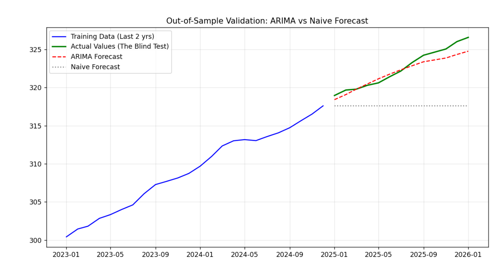
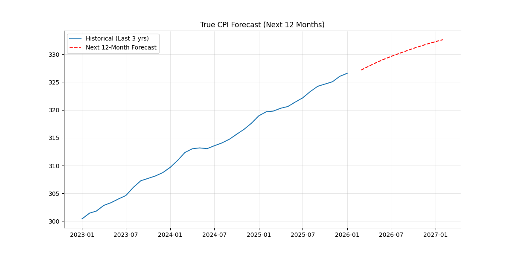

# CPI Forecasting using ARIMA(5,1,0)

## Overview

This project builds a univariate time-series forecasting model for the Consumer Price Index (CPI) using an ARIMA(5,1,0) specification.  

The objective is to:

1. Validate forecasting performance using a proper 12-month out-of-sample holdout  
2. Benchmark the model against a naive persistence forecast  
3. Generate a true 12-month forward CPI projection  

The project emphasizes correct validation methodology and avoidance of data leakage.

---
## Data Pipeline (Zapier → Google Sheets → Python)

CPI data is ingested through a lightweight automation pipeline:

1. **Zapier** runs on a schedule and calls the FRED CPIAUCSL.
2. The returned observations are appended into **Google Sheets** with columns: `Date`, `Value`.
3. The sheet is exported/downloaded as `cpi_data.csv` and used by the Python script for:
   - out-of-sample validation (12-month holdout)
   - true 12-month forward forecasting

## Data

- Frequency: Monthly  
- Total Observations: 190 months (~15.8 years)  
- Target Variable: CPI index level  

The data was cleaned and indexed by date prior to modeling.

---

## Model Specification

ARIMA(5,1,0)

- **d = 1** → First differencing applied to remove CPI trend and achieve stationarity  
- **p = 5** → Five autoregressive lags capturing inflation momentum  
- **q = 0** → No moving-average component  

After differencing, the model estimates:

y′ₜ = c + φ₁y′ₜ₋₁ + φ₂y′ₜ₋₂ + φ₃y′ₜ₋₃ + φ₄y′ₜ₋₄ + φ₅y′ₜ₋₅ + εₜ

---

## Validation Design (No Data Leakage)

To ensure realistic forecasting performance:

- Training Set: First 178 months  
- Test Set: Final 12 months (held out)  

The model forecasts the hidden 12 months and compares predictions against actual CPI values.

A naive baseline is used for benchmarking:

Naive Forecast:  
Next value = Last observed value

---

## Out-of-Sample Performance

ARIMA RMSE: 0.8921  
Naive RMSE: 5.3743  

ARIMA MAE: 0.6927  
Naive MAE: 4.7434  

MAPE: 0.21%

The ARIMA model significantly outperforms the naive persistence benchmark, demonstrating strong short-term predictive accuracy.

---

## Outputs

- `validation_plot.png` — 12-month holdout validation (ARIMA vs Naive)  
- `future_forecast.png` — True 12-month forward CPI forecast  
- `validation_metrics.txt` — Numerical performance summary  

---

## Forecast Interpretation

The forward 12-month projection suggests continued upward CPI momentum consistent with recent inflation dynamics.  

Forecast reliability decreases as the horizon extends beyond 12 months.

---

## Limitations

- ARIMA assumes linear structure and may underperform during structural economic shocks.  
- Seasonal components are not explicitly modeled (SARIMA could be explored if seasonality is significant).  
- Model performance is optimized for short-term forecasting.

---

## How to Run

Install dependencies:
# CPI Forecasting using ARIMA(5,1,0)

## Overview

This project builds a univariate time-series forecasting model for the Consumer Price Index (CPI) using an ARIMA(5,1,0) specification.  

The objective is to:

1. Validate forecasting performance using a proper 12-month out-of-sample holdout  
2. Benchmark the model against a naive persistence forecast  
3. Generate a true 12-month forward CPI projection  

The project emphasizes correct validation methodology and avoidance of data leakage.

---

## Data

- Frequency: Monthly  
- Total Observations: 190 months (~15.8 years)  
- Target Variable: CPI index level  

The data was cleaned and indexed by date prior to modeling.

---

## Model Specification

ARIMA(5,1,0)

- **d = 1** → First differencing applied to remove CPI trend and achieve stationarity  
- **p = 5** → Five autoregressive lags capturing inflation momentum  
- **q = 0** → No moving-average component  

After differencing, the model estimates:

y′ₜ = c + φ₁y′ₜ₋₁ + φ₂y′ₜ₋₂ + φ₃y′ₜ₋₃ + φ₄y′ₜ₋₄ + φ₅y′ₜ₋₅ + εₜ

---

## Validation Design (No Data Leakage)

To ensure realistic forecasting performance:

- Training Set: First 178 months  
- Test Set: Final 12 months (held out)  

The model forecasts the hidden 12 months and compares predictions against actual CPI values.

A naive baseline is used for benchmarking:

Naive Forecast:  
Next value = Last observed value

---

## Out-of-Sample Performance

ARIMA RMSE: 0.8921  
Naive RMSE: 5.3743  

ARIMA MAE: 0.6927  
Naive MAE: 4.7434  

MAPE: 0.21%

The ARIMA model significantly outperforms the naive persistence benchmark, demonstrating strong short-term predictive accuracy.

---

## Outputs

- `validation_plot.png` — 12-month holdout validation (ARIMA vs Naive)  
- `future_forecast.png` — True 12-month forward CPI forecast  
- `validation_metrics.txt` — Numerical performance summary  
## Validation Plot

## Future Forecast

---

## Forecast Interpretation

The forward 12-month projection suggests continued upward CPI momentum consistent with recent inflation dynamics.  

Forecast reliability decreases as the horizon extends beyond 12 months.

---

## Limitations

- ARIMA assumes linear structure and may underperform during structural economic shocks.  
- Seasonal components are not explicitly modeled (SARIMA could be explored if seasonality is significant).  
- Model performance is optimized for short-term forecasting.

---

## How to Run

Install dependencies:
pip install pandas numpy matplotlib statsmodels scikit-learn

Run the script:

python cpi_forecast.py
The script generates validation results and saves forecast plots.
## Author 
Meherab Hossain Shafin
Undergraduate time-series forecasting project demonstrating applied ARIMA modeling with proper out-of-sample validation.
Time-series forecasting project for academic and portfolio demonstration purposes.
